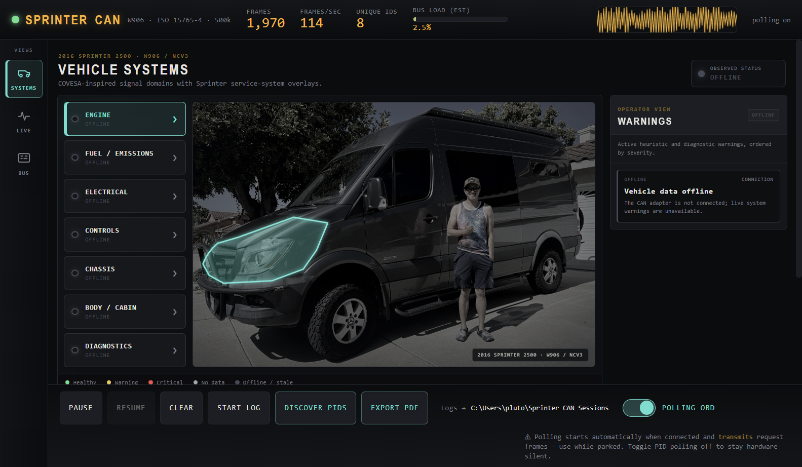
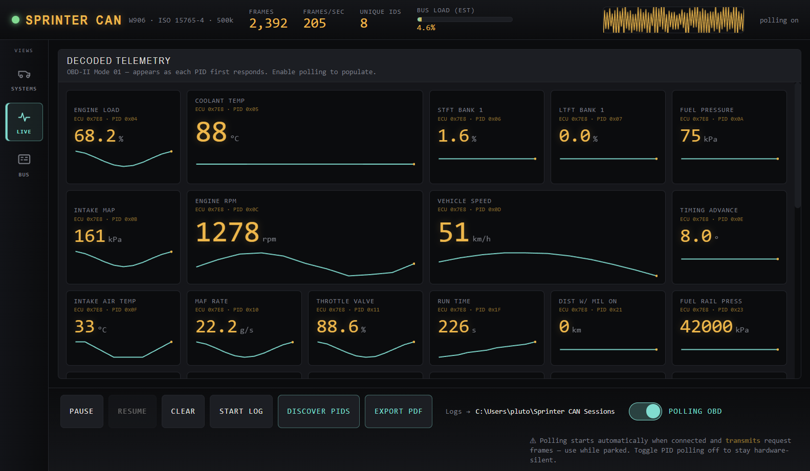
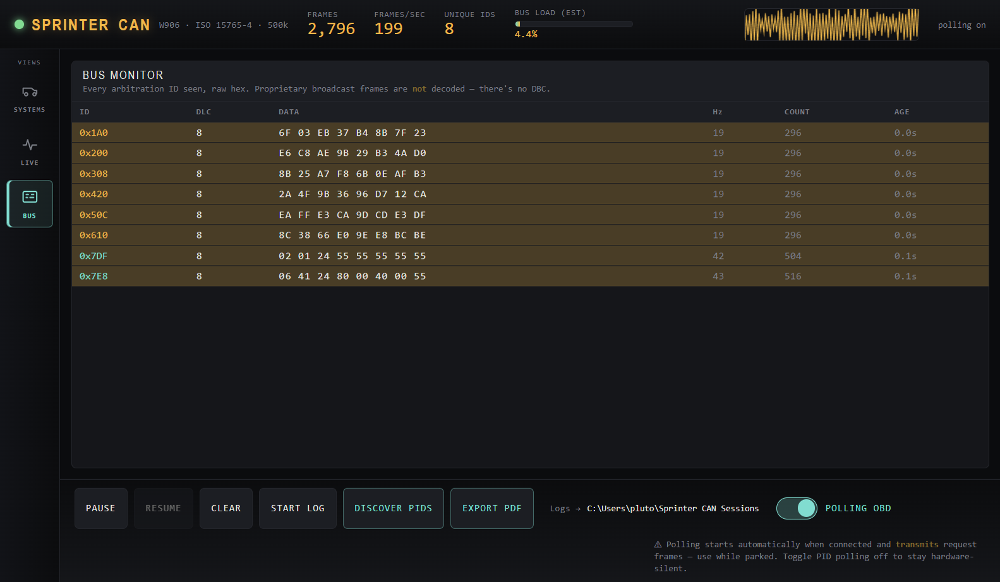
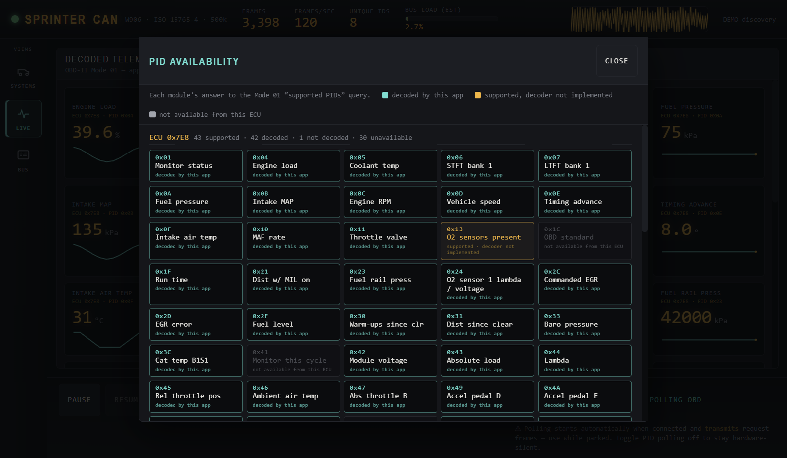

# Sprinter CAN Telemetry

A desktop **Electron** app that shows **live CAN bus telemetry** from a 2016
Mercedes Sprinter 2500 (NCV3 / W906, OM642 3.0L V6 diesel), read through a
**Kvaser U100** USB-CAN interface on the OBD-II port.

The left navigation rail provides three views:

- **Decoded telemetry** — OBD-II Mode 01 PIDs (RPM, speed, coolant, etc.) on
  cards with live values + sparklines.
- **Bus monitor** — every raw CAN frame seen, as hex, with rolling rate and age.
- **Vehicle systems** — large touch-friendly selectors beside a real W906
  photograph that group observed evidence into Engine, Fuel/Emissions,
  Electrical, Controls, Chassis, Body/Cabin, and Diagnostics. Selecting a
  system highlights the corresponding physical region on the vehicle.

By default the app **auto-polls**: as soon as the Kvaser adapter connects it
starts OBD polling so the live views populate on their own, and it resumes
polling automatically after an unplug/replug. Polling reopens the adapter in
active mode and transmits request frames, so use it parked. Toggle **PID
polling** off (or set `autoPoll: false`) to keep the adapter in its real
**hardware-silent mode**, where it does not transmit, acknowledge, or inject
error frames until you opt in.

```text
Electron shell or browser
        ↕ localhost HTTP commands + Server-Sent Events
Python collector service
        ├── session recorder → raw BLF + telemetry SQLite + metadata
        ├── replay reader
        └── CAN bridge → python-can → Kvaser U100 → OBD-II
```

---

## Preview

The screenshots below are from **demo mode** (`npm run demo`) — a simulated
running engine, so no hardware is needed to reproduce them.

### Vehicle systems

Live OBD evidence mapped onto a photograph of the actual van, with a severity
sorted operator-warning rail on the right.



### Live telemetry

Decoded OBD-II Mode 01 PIDs on cards with live values and sparklines.



### Bus monitor

Every raw CAN frame seen, as hex, with rolling rate and age. The functional
request (`0x7DF`) and ECM response (`0x7E8`) rows are highlighted.



### PID discovery

Per-module PID availability: cyan = decoded by the app, amber = supported but
not yet decoded, grey = catalogued but unavailable from that ECU.



---

## Architecture

1. **`can_service.py` / `sprinter_can.service`** — long-running collector.
   Serves the dashboard and API, owns reconnect behavior, and continues
   collecting even when no browser is connected.
2. **`can_bridge.py`** — transport-independent CAN acquisition and OBD decoder
   using the `python-can` Kvaser backend. It supports live hardware, demo data,
   and recorded-log replay.
3. **`sprinter_can.recording`** — session recorder for raw CAN logs, indexed
   decoded telemetry, monitor status, service events, and atomic metadata.
4. **`main.js`** — thin Electron shell. Starts the collector on a localhost
   dynamic port and loads its dashboard; it does not process CAN frames.
5. **`renderer/`** — HTML/CSS/vanilla JS client using same-origin HTTP commands
   and Server-Sent Events. The same UI works in Electron or a browser.

---

## Install

### 1. Kvaser CANlib driver
Install **Kvaser Drivers for Windows** (includes CANlib) from
<https://www.kvaser.com/download/>. On Linux, install **linuxcan**. `python-can`'s
kvaser backend talks to this driver — without it the collector will report an error.

On Raspberry Pi OS, the release bundle includes
`install-kvaser-driver-pi.sh`. Run it once with an internet connection; it
installs matching kernel headers and DKMS, downloads the current LinuxCAN
package from Kvaser, compiles it for the running Pi kernel, and asks you to
reboot. This follows Kvaser's official
[Raspberry Pi LinuxCAN procedure](https://kvaser.com/developer-blog/installing-linuxcan-and-linux-drivers-on-a-raspberry-pi-pc/).

Plug in the U100 and confirm it appears in **Kvaser Device Guide** before
continuing.

### 2. Python collector deps
```sh
pip install -r requirements.txt
# (installs python-can)
```
Requires Python 3.9+.

### 3. Node / Electron deps
```sh
npm install
```

---

## Run

**Demo mode** (no hardware — simulated engine, great for UI work):
```sh
npm run demo
```

**Live mode** (real Kvaser U100):
```sh
npm start
```

**Touchscreen kiosk mode** (10.1-inch display / Raspberry Pi):
```sh
npm run kiosk
# UI-only test without CAN hardware:
npm run kiosk:demo
```

Kiosk mode opens full-screen at a 1280×800 design target. The responsive
layout also supports 1024×600 displays, uses 52–56 px touch targets, and keeps
vehicle-system selection outside the photograph.

### Transferable Raspberry Pi application

The ready-to-transfer ARM64 release is generated in `dist-pi/`:

```text
Sprinter-CAN-1.0.0-Raspberry-Pi-arm64.tar.gz
```

Copy that single archive to a Raspberry Pi 4 or newer running 64-bit Raspberry
Pi OS, extract it, and double-click the included `.AppImage`. The AppImage
contains Electron, an ARM64 Python 3.12 runtime, `python-can`, the collector,
and the dashboard. No Node/npm/pip installation is needed on the Pi.

To rebuild it from a Linux host or WSL:

```sh
npm ci
npm run build:pi
```

The AppImage itself needs no root installation. The Kvaser kernel driver is a
separate one-time system prerequisite; use the included
`install-kvaser-driver-pi.sh`.

**Headless/browser mode** (useful on Raspberry Pi):
```sh
python -B can_service.py --host 127.0.0.1 --port 8765
# open http://127.0.0.1:8765
```

For a lighter Pi installation, start Chromium after the service:
```sh
chromium --kiosk --app=http://127.0.0.1:8765
```

To access a Pi from another trusted device, bind `--host 0.0.0.0`; the service
does not yet provide authentication, so do not expose it to an untrusted
network.

**Replay a recorded raw log**:
```sh
npm run replay -- "path/to/session/raw.blf"
# or headless:
python -B can_service.py --replay "path/to/session/raw.blf"
```

Then in the app, flip **Poll PIDs** on (while parked) to populate the decoded
cards.

**Pause** freezes the displayed cards/table while capture continues in the
background. **Clear** starts a fresh scan session, including counters,
capabilities, monitor status, and report duration.

### Session Recording

**Start Log** records independently in the collector service, so changing pages
or closing a browser tab does not interrupt capture. Each session contains:

```text
YYYYMMDD_HHMMSS_<id>/
  raw.blf             Raw CAN frames for replay
  telemetry.sqlite3   Decoded PIDs, monitor states, and service events
  metadata.json       Vehicle, timestamps, counters, and stop reason
```

The default location is `Sprinter CAN Sessions` in Documents when launched
through Electron. Headless mode uses the same folder under the current user's
home directory. Recording is flushed and finalized during a normal shutdown.

### Vehicle Systems

The **Systems** page maps live OBD evidence onto a real W906 facelift
photograph. Large system selectors sit beside the vehicle so the image stays
clear and every target is easy to tap. Select a system to highlight its physical
region and see its status and exact PID/ECU readings beneath the photograph.

Live telemetry cards and the smaller system-evidence cards respond on hover and
open a detail panel when clicked. The panel explains the PID, shows its recent
trend and observed range, identifies the source ECU and related system groups,
and keeps heuristic hints clearly separate from manufacturer limits.

An operator warning rail stays on the right side of the Systems page. Critical
items appear before warnings, each card shows the system summary, and selecting
a card opens that system's evidence. When no flags are active, the rail shows an
explicit all-clear state.

The hierarchy is inspired by the
[COVESA Vehicle Signal Specification](https://covesa.github.io/vehicle_signal_specification/):
standard branches such as `Vehicle.Powertrain.CombustionEngine`,
`Vehicle.Powertrain.FuelSystem`, `Vehicle.Chassis`, `Vehicle.Body`,
`Vehicle.Cabin`, and `Vehicle.Diagnostics` are combined into service-friendly
Sprinter groups. This is a presentation overlay, not a claim that standard OBD
provides full manufacturer coverage.

Statuses are **Healthy**, **Warning**, **Critical**, **No data**, or
**Offline/stale**. They come only from observed signals, MIL/DTC count, and the
same light heuristic checks used by the report. A system with no applicable
signal stays **No data** rather than being guessed healthy.

#### Vehicle photograph

`assets/sprinter-mine.jpg` is a photo of this actual vehicle. The app darkens
and desaturates it through CSS; the source JPEG is otherwise stored unchanged.
To replace it with your own vehicle photo, replace the image while retaining
the current filename, or update the image path in `renderer/index.html`.

### Discover PIDs
The **Discover PIDs** button sends the Mode 01 "supported PIDs" queries
(`0x00/0x20/0x40/…`) and shows, per responding module (`0x7E8`, `0x7E9`, …),
the ECU's PID availability — cyan = decoded by the app, amber = supported but
the decoder is not implemented, and grey = a catalogued PID unavailable
from that ECU. Use it to see what this van actually answers (e.g. which
accelerator-pedal PID is live). Discovery *transmits* requests, so run it parked.
If normal polling is off, the adapter returns to hardware-silent mode immediately
after the discovery sweep. After discovery, polling automatically narrows to only
the PIDs the bus supports, so no TX is wasted on requests nothing answers.

### Check-engine (MIL) status
Mode 01 PID `0x01` is polled automatically; if any module reports the MIL lamp
on or stored DTCs, a red **● CEL (n)** badge appears in the header. (The actual
fault codes — Mode 03 — and diesel UDS data are a planned next step.)

### Export PDF
**Export PDF** produces a self-contained **health-scan report**. In the Electron
app it renders a real PDF and prompts for a save location; in a plain browser it
opens the equivalent self-contained HTML in a new tab to print to PDF (falling
back to an HTML download if the popup is blocked). Either way the report contains
summary KPIs, vehicle-system status, MIL/DTC status,
a per-module capability map, a live-telemetry snapshot with heuristic health
flags (OK / NOTICE / CHECK), and a complete inventory of every arbitration ID
seen during the app window. The inventory retains decoded and undecoded traffic,
11/29-bit format, observed diagnostic role, DLC range, last payload, frame
count, average rate, age, and average/peak estimated bus load. ECUs learned from
discovery, monitor replies, decoded PIDs, or raw `0x7E8–0x7EF` responses are all
included. The full scan data is also embedded as JSON inside the file
(`<script id="scan-data">`) for further analysis. Status flags are heuristic
hints, not a diagnosis.

### Hot-plug
You can start the app with **nothing plugged in**. It retries the connection
every 3 s, so the moment the U100 (and CANlib driver) become available it
connects on its own — no restart needed. The status dot tells the story:

- **amber + "searching…" banner** — no device yet; will connect automatically.
- **green** — bus open and frames flowing.
- **amber, no banner / "no frames" hint** — connected but idle (e.g. ignition off).
- **red** — a hard error that a replug won't fix (e.g. no Python interpreter).

Unplug while running and it drops back to amber "searching"; replug and it goes
green again. (The CANlib driver itself still needs to be installed once — that's
not hot-pluggable, but once it's there the *device* is.)

### Configuration
`config.json` controls the desktop launcher and collector; env vars override:

| Setting | config.json | env var          | default                       |
|---------|-------------|------------------|-------------------------------|
| Python  | `python`    | `PYTHON`         | `python` (win) / `python3`    |
| Channel | `channel`   | `KVASER_CHANNEL` | `0`                           |
| Demo    | `demo`      | `CAN_DEMO=1`     | `false` (or `--demo` flag)    |
| Service port | `servicePort` | — | `0` (dynamic) |
| Log directory | `logDirectory` | `CAN_LOG_DIR` | Documents/Sprinter CAN Sessions |
| Raw format | `rawLogFormat` | — | `blf` |
| Auto-record | `autoRecord` | `CAN_AUTO_RECORD=1` | `false` |
| Auto-poll | `autoPoll` | `CAN_AUTO_POLL=0/1` | `true` (or `--no-auto-poll`) |
| Sweep period | `pollPeriodMs` | `CAN_POLL_PERIOD_MS` | `1250` ms |
| Request gap | `interFrameMs` | `CAN_INTER_FRAME_MS` | `25` ms |
| Full-screen kiosk | `kiosk` | `CAN_KIOSK=1` | `false` (or `--kiosk`) |

If the configured interpreter isn't found, the launcher falls back through
`python3` → `python` automatically.

The default 41-request pre-discovery sweep reserves 1.025 seconds for request
gaps plus 225 ms for send overhead. After discovery, only PIDs reported as supported
are polled. Increase the period or request gap to reduce diagnostic traffic;
avoid reducing them on a live vehicle without understanding the resulting bus
load.

---

## Wiring (already done on this rig)

| OBD-II pin | Signal | → | Kvaser DB9 pin |
|-----------|--------|---|----------------|
| 6         | CAN-H  | → | 7              |
| 14        | CAN-L  | → | 2              |
| 5         | GND    | → | 3              |

Bus: **ISO 15765-4, classic CAN (not FD), 500 kbit/s, 11-bit IDs.**
OBD addressing: functional request `0x7DF`, ECM physical `0x7E0`, ECM response
`0x7E8`. The U100 is galvanically isolated with no internal termination — none
needed in software.

### Supported PIDs (OBD-II Mode 01)
`A` = first data byte after the PID, `B` = second.

| PID  | Name              | Formula        | Unit |
|------|-------------------|----------------|------|
| 0x04 | Engine load       | A·100/255      | %    |
| 0x05 | Coolant temp      | A−40          | °C  |
| 0x0B | Intake MAP        | A              | kPa  |
| 0x0C | Engine RPM        | (256·A+B)/4   | rpm  |
| 0x0D | Vehicle speed     | A              | km/h |
| 0x0F | Intake air temp   | A−40          | °C  |
| 0x10 | MAF rate          | (256·A+B)/100 | g/s  |
| 0x11 | Throttle position | A·100/255     | %    |
| 0x24 | O2 sensor 1 lambda | (256·A+B)/32768 | λ |
| 0x24 | O2 sensor 1 voltage | (256·C+D)/8192 | V |
| 0x2F | Fuel level        | A·100/255     | %    |
| 0x42 | Module voltage    | (256·A+B)/1000| V    |
| 0x46 | Ambient air temp  | A−40          | °C  |
| 0x5C | Engine oil temp   | A−40          | °C  |

Not every PID is supported by this engine. Unsupported ones simply don't respond
— their card never appears. That's expected, not an error.

PID `0x24` is a compound response, so it creates separate lambda and voltage
cards. Later diesel PIDs may carry several measurements or require ISO-TP
multi-frame reassembly; they remain amber until both transport and decoding are
implemented.

---

## Honesty notes

- **Polling transmits, and auto-poll is on by default.** When connected the
  adapter is in active mode and *transmits* request frames, so use it parked.
  Switch PID polling off (or `autoPoll: false` / `--no-auto-poll`) to return to
  the hardware-silent state.
- On the OBD diagnostic bus, **passive raw traffic may be sparse** — it's
  largely request/response. Raw frames are shown as hex but **not decoded**;
  meaningful decoded values come from OBD PID polling.
- Proprietary Mercedes broadcast frames are **not** decoded — there's no DBC.
- Bus load is an **estimate**: `Σ (47 + 8·DLC) bits / 500000` over the last
  second. It ignores stuffing/exact framing, so treat it as a relative gauge.

---

## Troubleshooting

| Symptom | Likely cause / fix |
|---------|--------------------|
| Banner: *"python-can not installed"* | `pip install -r requirements.txt` into the interpreter named in `config.json`. |
| Banner: *"Could not open Kvaser channel 0"* | CANlib driver not installed, U100 unplugged, or wrong channel. Check Kvaser Device Guide; set `KVASER_CHANNEL` / `config.json`. |
| Banner: *"Could not start a Python interpreter"* | Python not on PATH. Set `python` in `config.json` to a full path. |
| Dot is **amber**, zero frames | Connected but idle. Ignition may be off, or you're on a quiet bus — enable **Poll PIDs**. |
| Dot is **red** | Collector errored or exited — read the banner / connection text. |
| Frames flowing but **no decoded cards** | Enable **Poll PIDs**. Cards appear only as each PID first responds; unsupported PIDs never will. |
| Wrong channel | The U100 enumerates as a channel index; if you have multiple Kvaser devices try `1`, `2`, … |
| Nothing at all | Verify wiring (pins 6/14/5 → DB9 7/2/3) and that you're on the **OBD/diagnostic** bus with ignition ON. |

---

## Tests

```sh
npm test       # Node renderer helpers + Python decoder tests
npm run check  # JavaScript syntax checks, then the complete test suite
```

The tests require no CAN hardware. They cover decoding, silent/active mode
transitions, replay, broker backpressure, the HTTP service, BLF recording,
SQLite persistence, and renderer status logic.

---

## Files

```
package.json        Electron app manifest + scripts
main.js             Thin Electron shell for the localhost collector
can_service.py      Headless collector-service entry point
can_bridge.py       CAN acquisition, decoding, demo, and replay
requirements.txt    Python deps (python-can)
config.json         Desktop, collector, logging, and polling settings
sprinter_can/
  broker.py         Bounded live-event fan-out and state snapshots
  recording.py      BLF + SQLite + metadata session persistence
  service.py        HTTP/SSE server, commands, reconnects, and lifecycle
renderer/
  assets/           Vehicle photo used as the Systems-map base image
  index.html        Dashboard markup
  styles.css        Amber-phosphor instrument-cluster theme
  core.js           Formatting, health, ECU keys, and system-status model
  app.js            View navigation, live rendering, reports, and controls
tests/              Node renderer tests + Python OBD decoder tests
```
